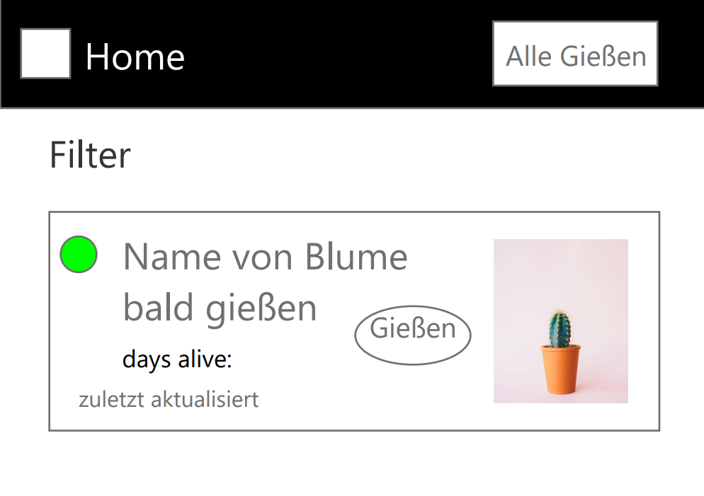
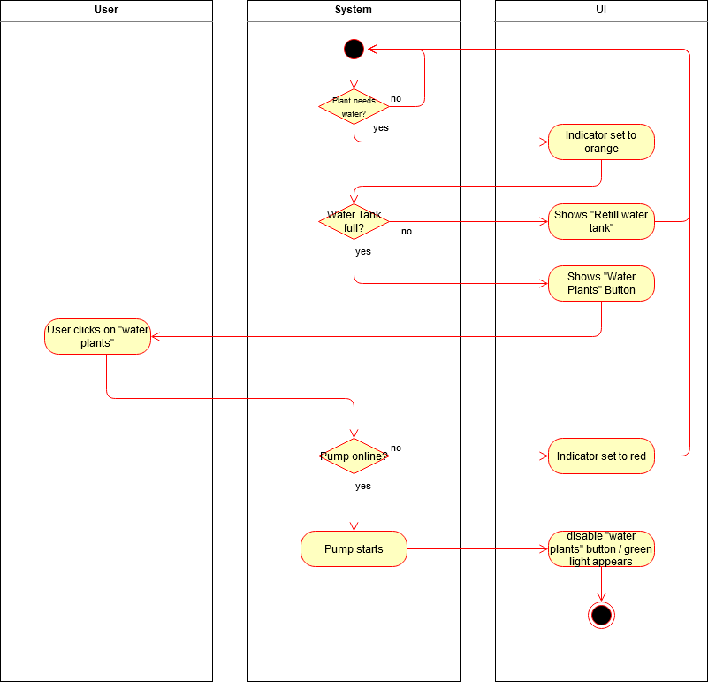

# Use-Case Specification: Add Plant

# 1. Add Plant

## 1.1 Brief Description
The user can start the watering mechanism manually. When the moisture of the plant is low, the app shows you that the plant needs water and that you can water them. When there is enough moisture, you can't water your plant. This pervents that the user overwaters their plants.

## 1.2 Mockup

## 1.3 Screenshot
n/a

# 2. Flow of Events

## 2.1 Basic Flow

### Activity Diagram

### .feature File

[.feature file](../../lazyplants/test_driver/water_plants.feature)  

## 2.2 Alternative Flows
n/a

# 3. Special Requirements
n/a

# 4. Preconditions
The main preconditions for this use case are:

 - The user started the app.
 - The user has an internet connection.
 - The user has to be logged in.
 - The user has at least one plant configured.

# 5. Postconditions

n/a

# 6. Function Points
n/a
